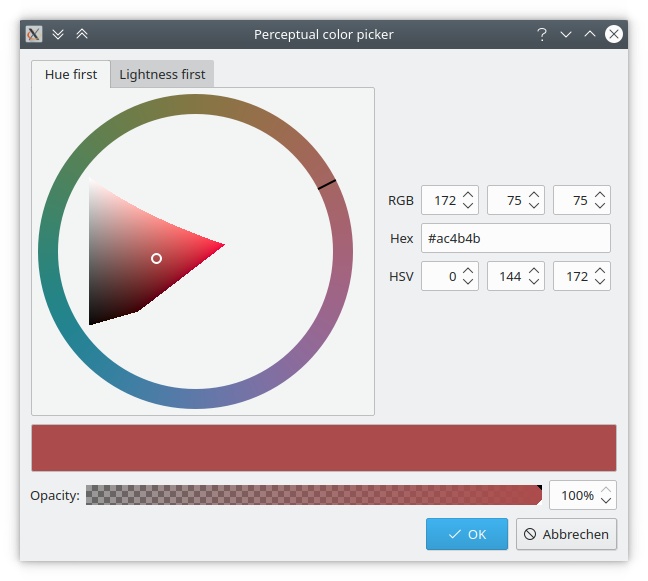
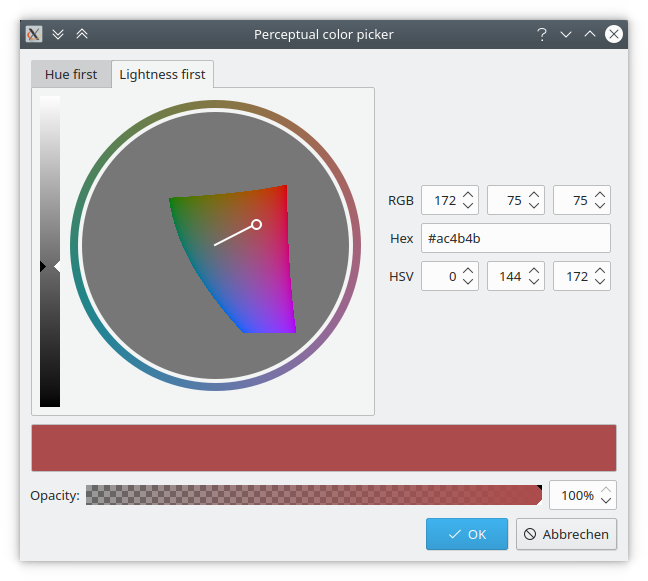

# PerceptualColor
A library providing Qt widgets for perceptual color selection, based on the LCh model. And a standalone application similar to KColorChooser.

## CMake Qt5 GUI Template

You need Qt5 and CMake 2.8.11 or higher

-- Build instructions --

cd /your/project/build
cmake ../
make

./perceptualcolorpicker

## Tutorials and resources

Qt online docs
https://doc.qt.io/
